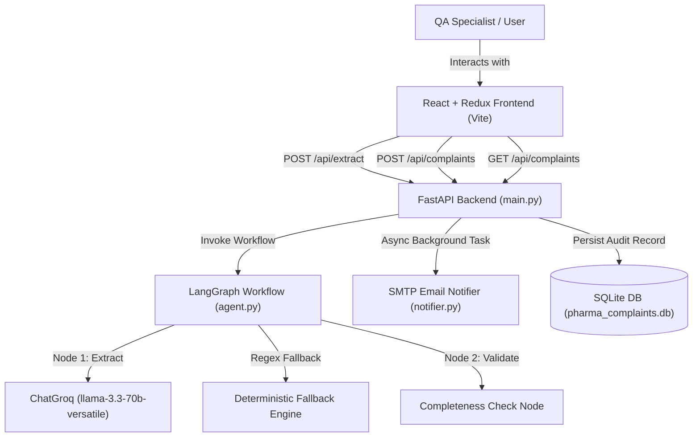

# AIVOA AI Customer Complaint System

An autonomous AI agentic platform designed for pharmaceutical Quality Assurance (QA) and Regulatory Compliance. The system automatically processes raw customer and patient complaints (emails, call transcripts, PDFs), extracts structured complaint metadata, validates regulatory completeness, enforces a formal **Pharma Risk Matrix**, generates Corrective and Preventive Action (**CAPA**) plans, and triggers automated background email alerts for critical high-risk events.

---

## Key Features

- **Autonomous Extraction Agent**: Powered by **LangGraph** and **Groq LLM** (`llama-3.3-70b-versatile` with `llama3-8b-8192` fallback) for structured extraction of drug names, batch/lot numbers, complaint categories, and defect descriptions.
- **Completeness Verification Node**: Evaluates required regulatory parameters (`product_name`, `batch_number`) and flags incomplete records with actionable warning tags.
- **Formal Pharma Risk Matrix & CAPA Engine**:
  - **HIGH RISK (Critical)**: Contamination, sterility breach, adverse reactions $\rightarrow$ CAPA: *"Immediate batch recall review, site audit, and 24-hour regulatory notification."*
  - **MEDIUM RISK (Major)**: Physical defects (discoloration, crumbling, broken packaging) $\rightarrow$ CAPA: *"Investigate manufacturing batch records, conduct retain-sample testing, and issue vendor quality alert."*
  - **LOW RISK (Minor)**: Labeling typos, cosmetic carton damage, general inquiries $\rightarrow$ CAPA: *"Log trend in QMS and monitor during quarterly review."*
- **Asynchronous Email Alerts**: Uses FastAPI `BackgroundTasks` and Python `smtplib` to dispatch HTML alerts for High Risk / Critical events asynchronously.
- **Modern React + Redux Frontend**: Sleek pharmaceutical QA dashboard built with React, Redux Toolkit, and Vite.
- **Audit Trail & Search Filters**: Search input and multi-criteria dropdown filtering by Severity (`Critical`, `Major`, `Minor`) and Risk (`High`, `Medium`, `Low`).
- **Data Export & Reporting**:
  - **Export CSV**: Download filtered complaint records directly to `.csv`.
  - **PDF CAPA Report**: Generate 21 CFR Part 11 compliant printable PDF summary reports with QA electronic signature blocks.

---

## Tech Stack

| Layer | Technologies Used |
| :--- | :--- |
| **AI Agent Logic** | LangGraph, LangChain Groq, Pydantic, Python 3.14 |
| **LLM Models** | Groq `llama-3.3-70b-versatile`, `llama3-8b-8192` |
| **Backend API** | FastAPI, Uvicorn, BackgroundTasks |
| **Database & ORM** | SQLite, SQLAlchemy 2.0 |
| **Frontend Framework** | React 18+, Vite 8+, Redux Toolkit, React-Redux |
| **Styling & Icons** | Vanilla CSS Glassmorphism Design System, Lucide React Icons |

---

## System Architecture



---

## Installation & Setup

### Prerequisites
- Python 3.10+
- Node.js 18+ & npm

### 1. Repository Setup & Environment Configuration
Clone the repository and create your local `.env` file:
```bash
git clone https://github.com/your-username/aivoa-pharma-complaint-system.git
cd aivoa-pharma-complaint-system

# Copy environment template
cp .env.example .env
```
Edit `.env` and add your Groq API key:
```env
GROQ_API_KEY=gsk_your_actual_groq_api_key_here
```

### 2. Backend Setup
```bash
# Create and activate Python virtual environment
python -m venv .venv
# On Windows:
.venv\Scripts\activate
# On macOS/Linux:
# source .venv/bin/activate

# Install dependencies
pip install -r requirements.txt

# Start FastAPI backend server
uvicorn backend.main:app --reload --port 8000
```
The FastAPI backend will be available at `http://localhost:8000`.

### 3. Frontend Setup
In a new terminal window:
```bash
cd frontend

# Install Node dependencies
npm install

# Start Vite dev server
npm run dev
```
The React frontend dashboard will open at `http://localhost:5173`.

---

## API Endpoints Reference

### `POST /api/extract`
Accepts raw complaint text and runs the LangGraph extraction workflow.
- **Request Body**:
  ```json
  {
    "raw_text": "Hospital pharmacy reports discolored tablets in Amoxicillin 500mg batch AMX-2024-8891."
  }
  ```
- **Response**:
  ```json
  {
    "product_name": "Amoxicillin 500mg",
    "batch_number": "AMX-2024-8891",
    "complaint_type": "Quality",
    "severity_level": "Major",
    "description": "...",
    "risk_classification": "Medium",
    "suggested_capa": "Investigate manufacturing batch records, conduct retain-sample testing, and issue vendor quality alert.",
    "is_complete": true,
    "missing_fields": []
  }
  ```

### `POST /api/complaints`
Saves verified complaint record into the SQLite database.

### `GET /api/complaints`
Retrieves all logged complaints ordered newest first.

---

## Running Unit & Integration Tests

Run the complete Python unittest suite:
```bash
.venv\Scripts\python -m unittest discover -s . -p "test_*.py"
```

---

## License

This project is licensed under the MIT License.
